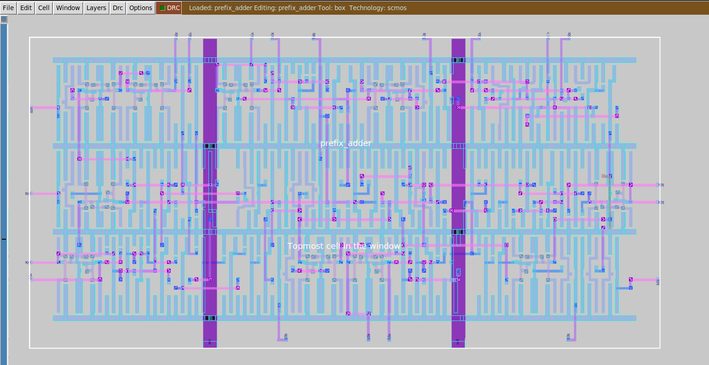

# Verilog Prefix Adder

This project covers the implementation of a 6-bit prefix adder, using the Verilog HDL and Qflow suite.

For more details see the [detailed documentation](docs/out/main.pdf)
 (polish).